# POS Inventory System

## Overview

- The **POS Inventory System** is an application developed to help gadget peripherals and accessories stores efficiently manage their inventory and sales operations in one centralized platform. It caters to small and medium-sized businesses by providing an organized way to monitor products, process customer transactions, and manage stock levels. The system is designed for both administrators and staff, where administrators can manage products, categories, accounts, and reports, while staff can efficiently process sales through the point-of-sale interface. With features such as inventory tracking, sales history, XML import/export, and real-time stock monitoring, the system improves operational efficiency, reduces manual errors, and streamlines daily business activities.

## Online Site
- Linked to an online hosted version of the POS System. fully working https://k-inventory.html-5.me/
- **Admin account:**
  - **Username:** `admin`
  - **Password:** `admin`

- **User account:**
  - **Username:** `User`
  - **Password:** `1234`

## Members
- Sean
- Limo
- Cerbo
- Bettina
- Calinaya
- Morimitsu
 
# Features

## Login
- Login using an Admin account
- Login using an User/Staff account

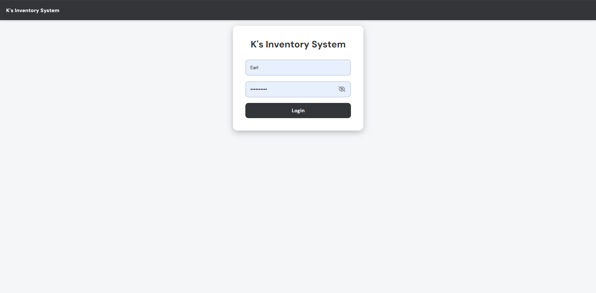

# Admin Side:

## Dashboard
- Statistical metric summaries: Total Products, Total Units, Low Stock, Out of Stock, Total Revenue, Total COGS, Total Purchases, Total Profit, and Total Sales.
- Real-time graph and top 5 selling products: Revenue, Net profit, Inventory purchases, Top 5 Selling Products
- Real-time Notifications panel tracking: Added/Deleted/Edited products, low stock alerts, new user registrations, and completed sales transactions.

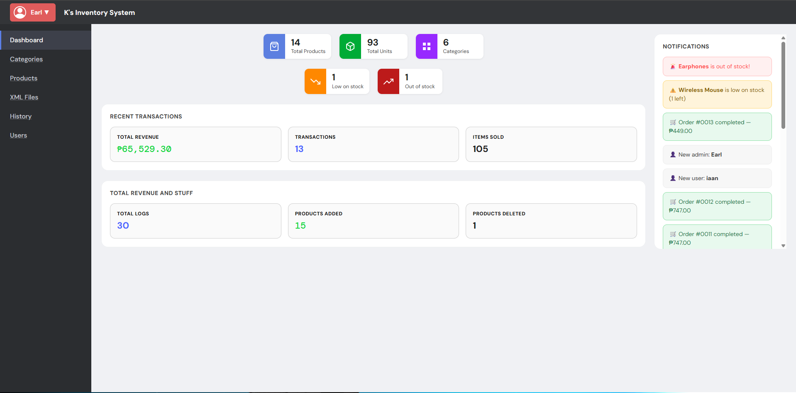

## Category Management
- Add, view, edit, and delete product categories.

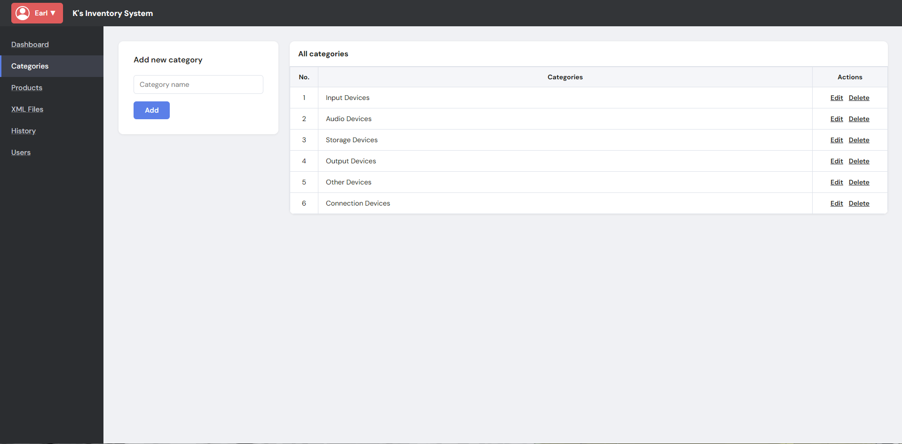

## Product Management
- List all products with details: Product No., Name, Category, Brand, Color, Size, Cost price (Bought), Retail price (Selling), and Stock levels.
- Direct inventory action buttons: restock batches, edit product details, or delete items.
- Search filter by keyword or matching name.
- Filter by categories, brands, and colros.

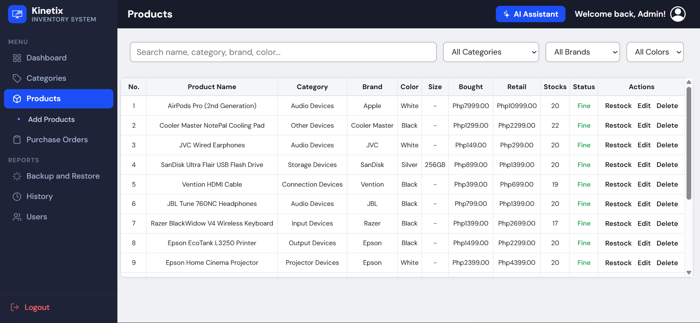

## Add Product
- Form to add new inventory products: specify name, category, initial cost price, initial retail selling price, stock quantities, technical specifications, description, and upload product images or 3D asset models (.glb/.gltf format).

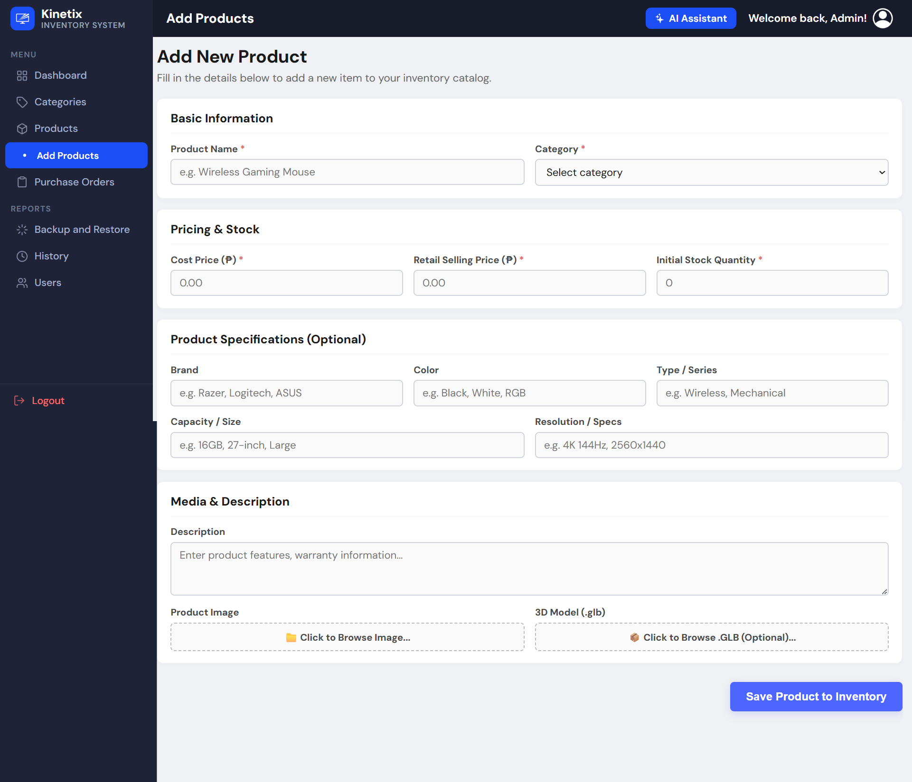

## Purchase Orders & Procurement
- Search inventory products to dynamically generate supplier restocking batches.
- Manage draft purchase orders and track incoming deliveries.
- Log incoming batches into inventory records once physically checked into shelves.

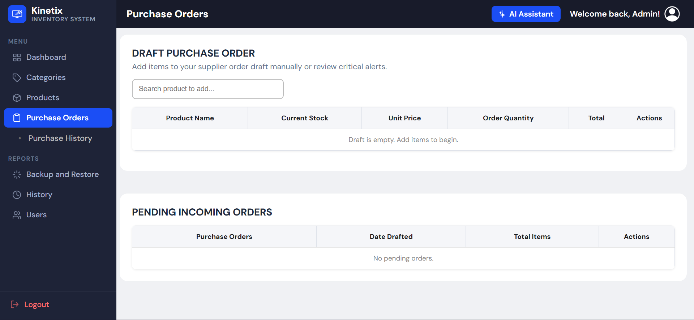

## Purchase History
- Log records of all completed supplier purchase orders.

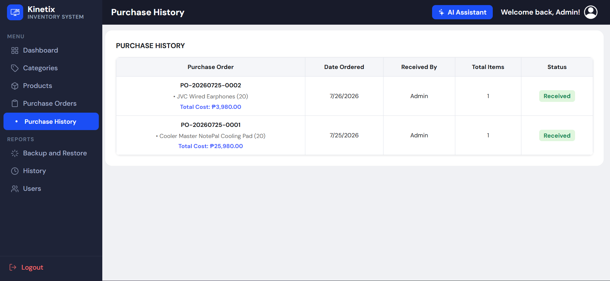

## Backup and Restoration
- Database XML export utility: download single tables or the entire consolidated database backup file.
- Database XML import utility: restore single table backups or full database states.

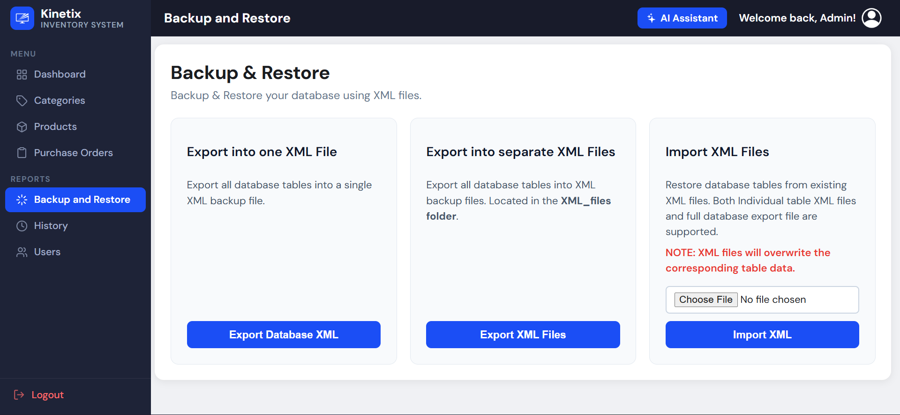

## History Logs
### Sales History
- Records and archives all POS cashier transactions.
- Highlights: Order No., Itemized summaries, Payment methods, applied discounts, and total transaction amounts.
- Action triggers: Click to view/print digital receipts or export filtered lists into Microsoft Excel formats.
- **Excel Export:** Export currently filtered transactions as native `.xls` spreadsheets with gridlines and formatted order numbers.

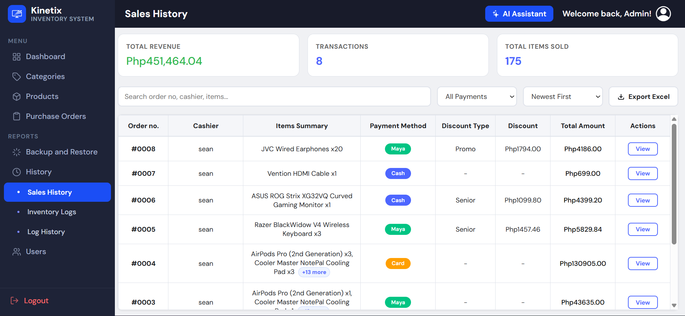

### Inventory Logs
- Auto-ledger tracking stock quantity modifications, edits, additions, and deletions.
- Records old stock levels, new stock levels, active modifiers, and timestamped actions.
- **Excel Export:** Export active inventory modification logs into styled spreadsheets.

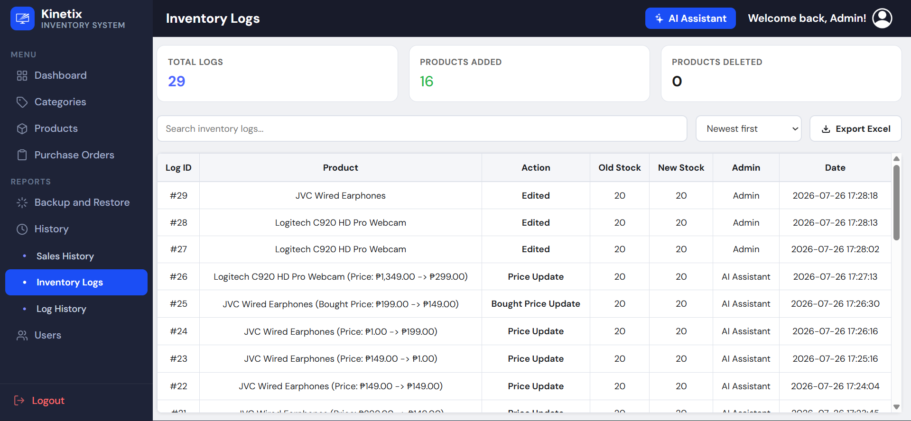

### Logs History
- Keyword search utility for specific system history logs.

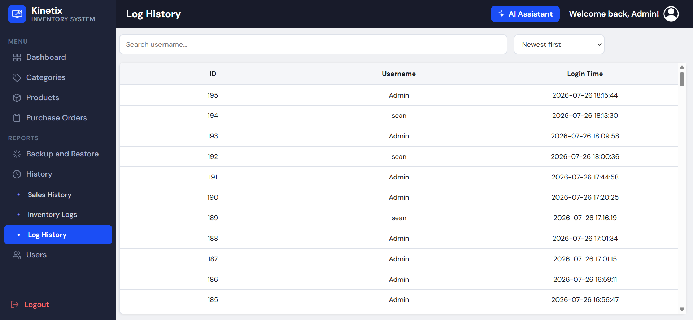

## Accounts Management
- Statistics overview: Total accounts, Admin accounts, and Staff accounts.
- Set SMTP email credentials to receive critical automated notifications.
- Create, update, or remove Admin and Staff user credentials.

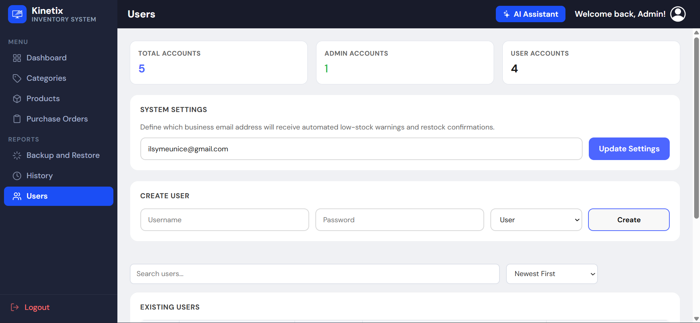
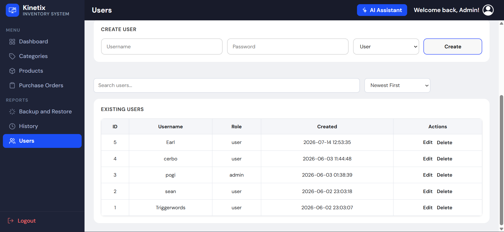

# User Side:
## POS System
- Shows all items in the database with their respective images and 3D models.
- Real-time stock indicator displays (automatically grays out items when sold out).
- Category, brands, price, and stock filtering and real-time search inputs to find products quickly.
- **Interactive 3D Product Viewer:** Cashiers can click "View" on any product to open a premium details modal featuring an interactive 3D model viewport (supports rotation, zoom, drag) and technical attributes (cost, brand, dimensions, color, type).
- **Mobile Responsive Tabbed Layout:** On mobile screens, the terminal automatically transforms into a single-panel interface with bottom navigation tabs (`🏷️ Products` and `🛒 Cart` with a live badge item count) to prevent squishing and ensure fluid operations.

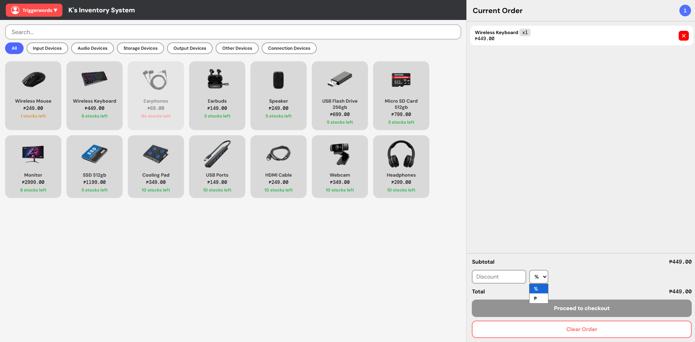

## Cart & Presets
- Displays all selected items inside the sidebar cart with a live quantity counter.
- Easy cart control operations (increment, decrement, and delete actions per line item).
- **Flexible Discounts:** Cashiers can input percentage discounts (e.g. `10%`) or flat currency discounts (e.g. `₱50`) directly on the transaction total.

## Checkout & Processing
- Itemized pricing breakdown displaying subtotal, discount reduction, and total due.
- Payment method options: Cash, Card, GCash, and Maya (with PayMongo redirects for digital options).
- Interactive cash-received field with instant change calculation.
- Automatically generates and displays receipt summaries upon checking out.

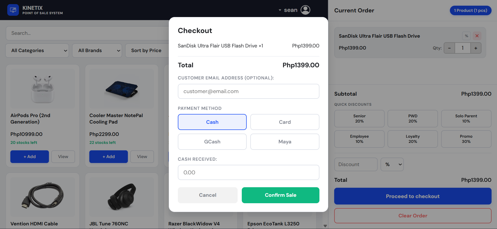

# Integration
1. **PayMongo Online Checkout API:** Point of Sale system directly integrated with the PayMongo API to accept card payments and local e-wallets (GCash and Maya) seamlessly via secure checkout session redirects.

2. **Automated SMTP Mail Service:** Automated background email notifications using SMTP protocols that instantly deliver stock alerts to administrators when items drop below critical levels.

3. **Interactive 3D Model Viewer:** Integration of Google's `<model-viewer>` library allowing administrators to upload `.glb` or `.gltf` 3D product models, which staff can interactively inspect in real-time.

4. **Native Excel Spreadsheet Exports:** Client-side spreadsheet builder that outputs files using the native `application/vnd.ms-excel` MIME type. Resolves the text import wizard prompt, keeps order number formats (preserving leading zeros), and shows up in the file browser under default spreadsheet filters.

5. **Conversational AI Assistant with Action Intents:** Natural-language bot powered by Groq API (Llama models). Includes:
   - **Database QA:** Evaluates natural language queries to generate safe SQL read commands.
   - **Continuous Conversation Context:** Tracks history states using sessionStorage to handle follow-up statements.
   - **Action Intent Execution:** Processes modification requests (like restocking, updating retail prices, and cost prices) directly into transactions. Includes support for bulk multi-command updates in a single prompt.

# Database
## Database Name
- inventory_db
