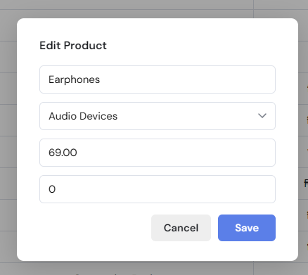
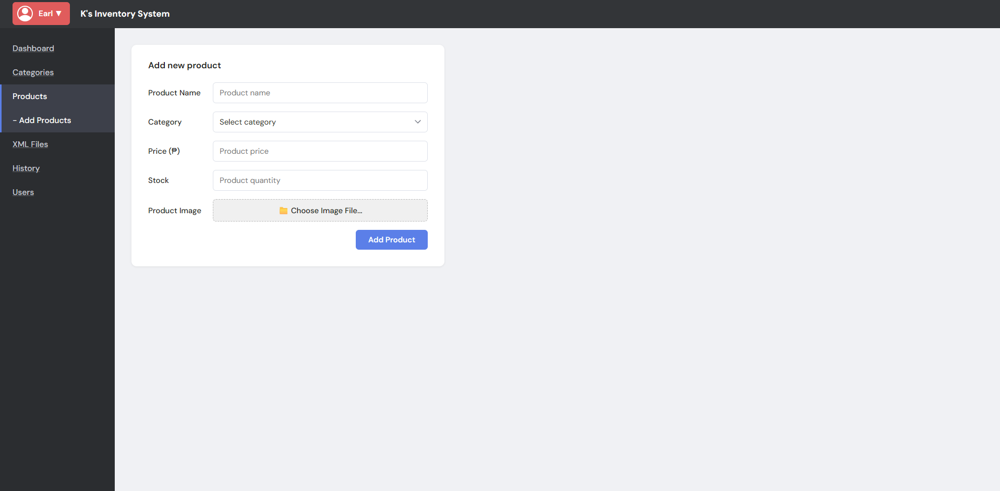
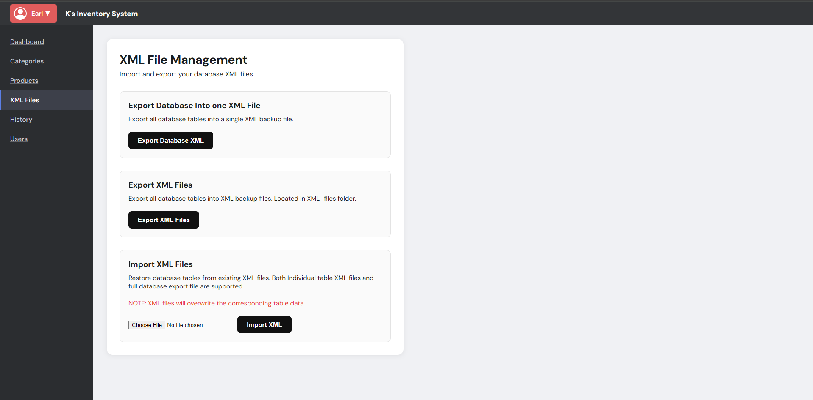
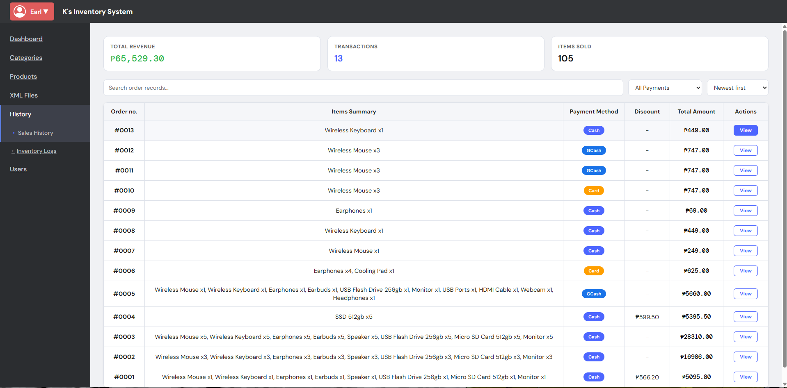
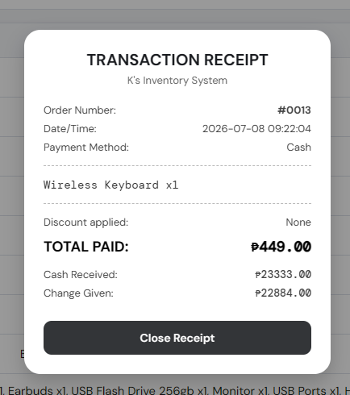
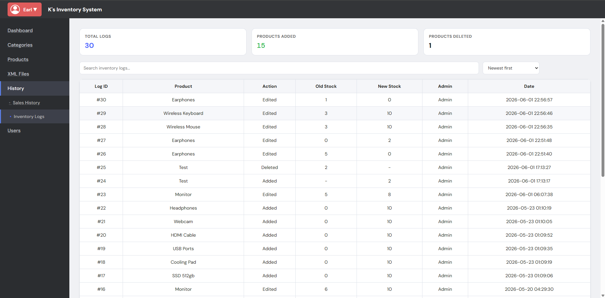
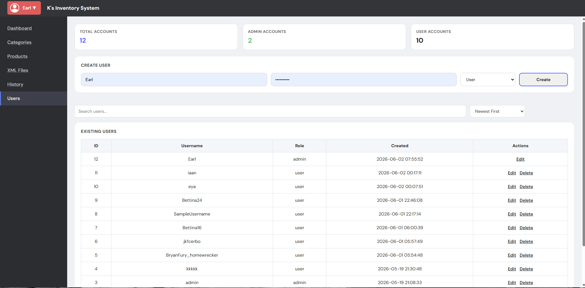

# POS Inventory System

## Overview

- The POS Inventory System is a web-based application developed to help businesses efficiently manage their inventory and sales operations in one centralized platform. It caters to small and medium-sized businesses, such as retail stores, mini marts, and shops, by providing an organized way to monitor products, process customer transactions, and manage stock levels. The system is designed for both administrators and staff, where administrators can manage products, categories, accounts, and reports, while staff can efficiently process sales through the point-of-sale interface. With features such as inventory tracking, sales history, XML import/export, and real-time stock monitoring, the system improves operational efficiency, reduces manual errors, and streamlines daily business activities.

## Members
- Sean
- Limo
- Cerbo
- Bettina
- Calinaya
- Morimitsu
 
# Features

## Login
- Can login using an Admin account
- Can login using an User/Staff account

# Admin Side:

## Dashboard
- Total Products
- Total Units
- Total Categories
- Low Stock
- Out of Stock
- Total Revenue
- Total Transactions
- Total Items Sold
- Total Logs
- Total Products Added
- Total Products Deleted
- Notifications tab: (Added product, Deleted product, Edited product, Stock alert, New user, Processed Orders)

## Category Management
- Add Category
- View Categories
- Edit Category
- Delete Category

## Product Management
- View All Products
- Search Product
- Add Product
- Edit Product
- Delete Product

- Product No. / Name / Catergory / Price / Stocks / Status (Fine,Low,Out of stock) / Actions (Edit or Delete)

## Add Product
- Enter Product Name
- Select Category
- Input price
- Input stock
- (optional, has default image) upload product image 

## XML Files
- Export each table in the database to individual files
- Export all database tables into one singular file
- Import XML 
- Import both works on individual files and database file

## History
### Sales History
- Records all the processed orders
- Order No. / Items Summary / Payment method / Discount / Total Amount / Actions (View Receipt)

### Inventory Logs
- Records changes made to the items
- Shows old and new stock when changed
- Shows when an item or stock gets deleted
- Shows when an item or stock gets added
- Shows date on each changes

## Accounts 
- Shows total accounts
- Shows total Admin accounts
- Shows total Staff accounts
- Admin can create a staff or an admin account
- Shows all of the existing staff (including admin)
- Admin can edit or delete staff accounts

# User Side :
## POS System
- Shows all of the items in the database
- Shows records of stock of each item
- Greys out items that are sold out
- User can filter items using categories
- User can search for an item
- Clicking on an item adds them to cart

## Cart
- Shows all of the items inside the cart
- User can remove the item from the cart
- User can input a discount, either percentage (%) or in pesos

## Checkout
- Shows a breakdown of the items price
- Shows the total of the order
- User can choose a payment method (Cash, Card, GCash, Maya)
- User inputs how much is paid
- System automatically calculates the change

# Database
## Database Name
- POS_Inventory_System

# Notes
## How to clone the repo
- Open xampp/htdocs folder in vscode
- Open view -> Terminal
- Type in "git clone https://github.com/itszshinnn/pos-inventory-system.git"
- Always pull before pushing changes.
- Use proper commit changes.
- PUT YOUR FRONTEND CODES IN THE .Drafts Folder, kami na ni sean mag coconnect nyan

## Git Commands
- git pull origin (branch name) | download all the latest code in this branch
- git checkout (branch name) | switch your workspace into an existing branch
- git merge (branch name)  | merge your target branch to your active current branch
- git push origin (branch name)  | uploads your local commit to your branch
- git status | checks what branch you are currently in

## Step by step
- Make sure you are in your own branch
- Add/edit your code
- Commit changes and add message/comment
- Push your updates to GitHub (into your own branch)
- Switch to main branch
- Always make sure you are update in main branch
- Merge your own branch into main branch
- Push the updated main branch to GitHub

## How to Add the database
- Open phpmyadmin on xampp
- On the left side bar press "New"
- Create database named "inventory_db"
- Once done ignore the add table name
- Click the "Import" tab above
- Click the "Choose File"
- Select inventory_db.sql
- Once uploaded go to the bottom and click import
